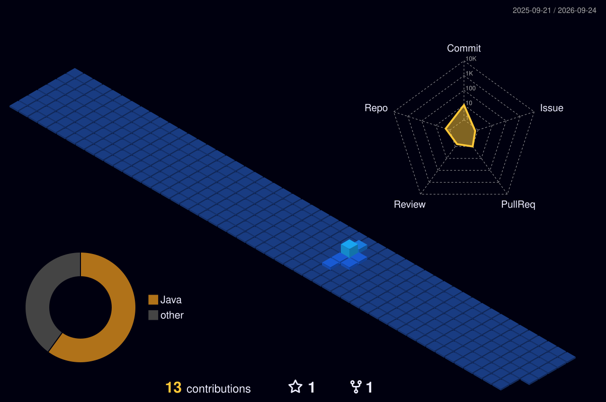

# Hi there, I'm Azhar Masood! 👋

### AI/ML Builder -- Learning by building [Mens et Manus]🚀

Welcome to my GitHub profile! I'm passionate about Artificial Intelligence, Machine Learning, and building intelligent applications that solve real-world problems.

---

### 👨‍💻 About Me
- 🔭 I recently built **MindTrace AI**, a complex behavioral intelligence Android app.
- 🌱 I’m currently diving deeper into **Agentic AI, LLM Integrations, and Deep Learning**.
- 💡 I love exploring the intersection of human behavior and machine intelligence.
- ⚡ Fun fact: I believe the best way to learn complex AI concepts is to just start building them!

---

### 🛠️ Technical Arsenal

**Data & AI/ML**

  
  
  
  

**App & Software Development**

  
  
  

---

### 📊 GitHub Stats

  
  

---
### 🏙️ My Contribution City

  

